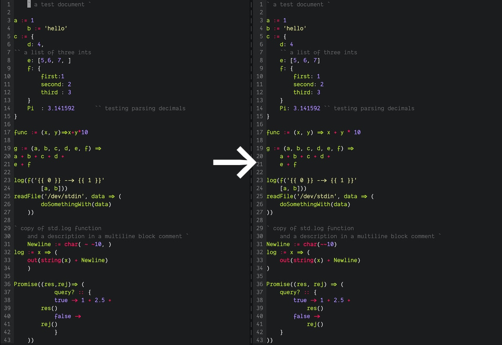

# inkfmt 🖋

**inkfmt** (pronounced "ink format") is a self-hosting code formatter for the [Ink programming language](https://dotink.co/). It's written in Ink itself, and designed to be run before commits to canonicalize syntax and whitespace, but still respects the code author's line breaks and comments. It's a work in progress, but gives the expected output for 95% of cases today.

All Ink code in this project is, of course, formatted with inkfmt. You can read an in-depth review of inkfmt's design and implementation in the [inkfmt post on the Ink blog](https://dotink.co/posts/inkfmt/).



inkfmt makes these transformations:

- Remove unnecessary commas
	- At ends of lines (Ink has automatic comma insertion at line endings)
	```
	a := 1,				a := 1
	b := 2,			->	b := 2
	c := a + b,			c := a + b
	```
	- At end of expression and argument lists
	```
	result := f(1, 2, [3, 4, ], {
		key: val,
	}, )
		->
	result := f(1, 2, [3, 4], {
		key: val
	})
	```
- Canonicalize whitespaces
	- Sensibly auto-indent lines
	```
	func := n => even?(n) :: {
     true -> 'is' +
      ' even'
			false -> 'is odd'
		}
		->
	func := n => even?(n) :: {
		true -> 'is' +
			' even'
		false -> 'is odd
	}
	```
    - Ensure single spaces between specific tokens, when appropriate
	```
	func := (x,y)=> pow(x,2)+3.1415
		->
	func := (x, y) => pow(x, 2) + 3.1415
	```

inkfmt intentionally avoids certain kinds of code transformations that might be disruptive to the intent of the code author.

- inkfmt doesn't **change line breaks** in code. Many other formatters like [Prettier](https://prettier.io) and [rustfmt](https://github.com/rust-lang/rustfmt) break lines according to some length heuristic, while others like [gofmt](https://golang.org/cmd/gofmt/) do not. I personally prefer formatters not to mess with my line breaks. Line breaks often convey important information, grouping arguments or list entries together in semantically important ways. If a line gets too long, I can manually break it in a sensible place. It might also be an indicator that there might be a better way to describe what I'm doing in code.
- inkfmt doesn't **add or remove idempotent parentheses**. Some more strict and deterministic formatters like [Prettier](https://prettier.io) will add and remove parentheses around expressions to disambiguate expressions or add consistency, but like line breaks, I think programmers use parentheses to group things in meaningful ways or make the code more readable, and formatters should clean them up, not remove them.

## Usage

At this point, the `fmt` program reads Ink code in from `stdin` and writes formatted code and/or errors out to `stdout`. Eventually, the goal will be for the executable to read a tree of files and format all Ink programs within.

With Ink installed, we can simply run:

```sh
./fmt.ink < input.ink > output.ink
```

## References and further reading

- Phil Wadler's [Prettier Printer](https://homepages.inf.ed.ac.uk/wadler/papers/prettier/prettier.pdf)
- Prettier's JavaScript implementation of the above, [GitHub](https://github.com/prettier/prettier-printer)
- Go's implementation of [gofmt](https://golang.org/src/cmd/gofmt/doc.go)
